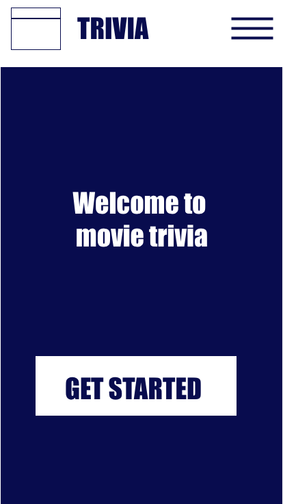
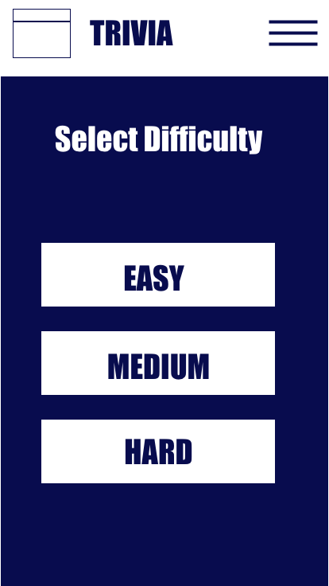
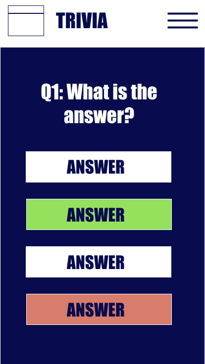
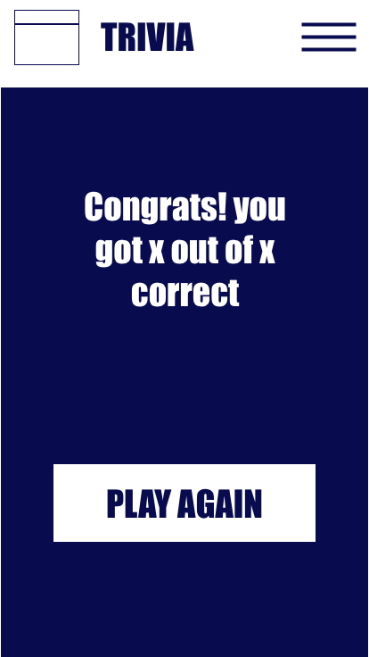
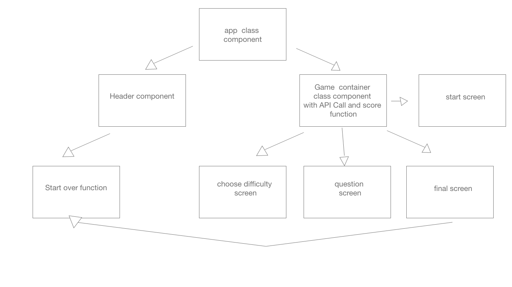

# Screen Test
[deployed site](https://screentest.netlify.com/)

## Description

Screen Test is a simple movie trivia game, displaying one question with four multiple choice answers at a time on the screen. after 5 questions, the user recieves a score based off of how many questions they correctly answered. it requires the functionality of fetching an array of question objects from an api and displaying them one by one as the user iterates through them.

## API
[OpenTDB](https://opentdb.com/api.php?amount=10&category=11)

## Wireframes

(   )

## Component Heirarchy

<!-- ## MVP
make an api call that returns an array of questions.
display those questions with answers one by one. the correct answer's order must be randomized. the next question is not displayed until an answer is given on the current answer. each answer contributes data to the score. on the final page, the score is displayed.
responsive design with 3 media queries

## Post MVP

let users choose the difficulty of the questions
delay timer after user answers question to display css animation of correct or incorrect on their answer.
ability to restart game at anytime from the header.
a time limit on each question
a fun logo? -->

